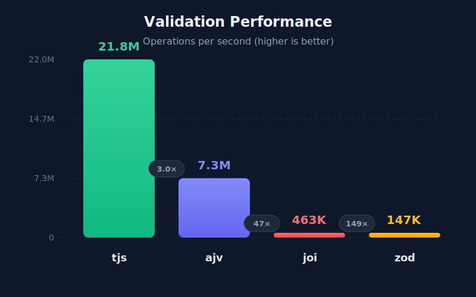

# tjs

[](https://www.npmjs.com/package/tjs)
[](https://github.com/sberan/tjs/actions/workflows/test.yml)

**The world's fastest and most accurate json-schema validator, with magical typescript inference.**



100% spec compliance. 40% faster than ajv. Zero dependencies. Full TypeScript inference.


## At a Glance

| | tjs | [ajv](https://github.com/ajv-validator/ajv) | [zod](https://github.com/colinhacks/zod) | [joi](https://github.com/hapijs/joi) |
|---|:---:|:---:|:---:|:---:|
| **JSON Schema compliance** | ✅ 100% | ⚠️ 94% | ⚠️ Basic | ❌ None |
| **TypeScript inference** | ✅ Built-in | ⚠️ Plugin | ✅ Built-in | ❌ None |
| **Dependencies** | ✅ 0 | ❌ 4+ | ✅ 0 | ❌ 5+ |
| **Performance** | ✅ Fastest | ⚠️ Fast | ❌ Slow | ❌ Slow |

## Installation

```bash
npm install tjs
```

## Quick Start

```typescript
import { schema } from 'tjs';

const User = schema({
  type: 'object',
  properties: {
    name: { type: 'string' },
    email: { type: 'string', format: 'email' },
    age: { type: 'integer', minimum: 0 },
  },
  required: ['name', 'email'],
});

type User = typeof User.type; // Extract the type


// Validate with full type inference
const user = User.assert(data);
//   ^? { name: string; email: string; age?: number }
```

## Why tjs?

 * Bridge the gap between json-schema and TypeScript types with no code duplication.
 * Types are guaranteed to be correct at compile time and run time.
 * Sticking to json-schema means your schema can be published to third parties with no translation layer.

### 100% JSON Schema Compliance 🎯

tjs passes the entire [JSON Schema Test Suite](https://github.com/json-schema-org/JSON-Schema-Test-Suite) — the official compliance benchmark:

| Draft | Compliance |
|-------|------------|
| draft-04 | 100% (881/881) |
| draft-06 | 100% (1170/1170) |
| draft-07 | 100% (1534/1534) |
| draft-2019-09 | 100% (1941/1941) |
| draft-2020-12 | 100% (1990/1990) |
| **Total** | **100% (7516/7516)** |

See [COMPLIANCE.md](COMPLIANCE.md) for details.

### Blazing Fast 🔥
tjs uses JIT compilation to generate optimized validation code — **40% faster than ajv** overall:

```
Performance vs ajv (JSON Schema Test Suite):
────────────────────────────────────────────────────────────────────────────
Draft          Files   Tests │ tjs ns/test  ajv ns/test      Diff
────────────────────────────────────────────────────────────────────────────
draft-04          38     790 │          36           53      -31%
draft-06          49    1120 │          34           46      -26%
draft-07          54    1324 │          39           53      -26%
draft-2019-09     69    1703 │          50           95      -47%
draft-2020-12     68    1665 │          49           90      -46%
────────────────────────────────────────────────────────────────────────────
TOTAL            278    6602 │          43           72      -40%
────────────────────────────────────────────────────────────────────────────
```

Format validation is where tjs really shines — up to **124x faster** for complex formats:

```
idn-email validation      124x faster than ajv
regex syntax validation    44x faster than ajv
date-time validation        5x faster than ajv
ipv6 validation             3x faster than ajv
```

### Magical Type Inference ✨

tjs infers TypeScript types directly from your schema — no code generation, no separate type definitions:

```typescript
import { schema } from 'tjs';

const Product = schema({
  type: 'object',
  properties: {
    id: { type: 'string', format: 'uuid' },
    name: { type: 'string' },
    price: { type: 'number', minimum: 0 },
    tags: { type: 'array', items: { type: 'string' } },
    status: { enum: ['active', 'discontinued'] },
  },
  required: ['id', 'name', 'price'],
});

// Extract the inferred type
type Product = typeof Product.type;
// { id: string; name: string; price: number; tags?: string[]; status?: 'active' | 'discontinued' }
```

Types are inferred for:
- All primitive types (`string`, `number`, `integer`, `boolean`, `null`)
- Arrays with `items` and `prefixItems` (tuples)
- Objects with `properties`, `additionalProperties`, `patternProperties`
- Union types via `anyOf`, `oneOf`
- Intersection types via `allOf`
- Const and enum literals
- Conditional schemas with `if`/`then`/`else`
- Recursive schemas with `$ref` and `$defs`

### Zero Runtime Dependencies 💎

tjs has **zero runtime dependencies**. The entire library is ~25KB minified.

Compare to ajv which requires:
- `fast-deep-equal`
- `json-schema-traverse`
- `require-from-string`
- `uri-js` (which itself has dependencies)

## API

### `schema(definition, options?)`

Create a validator from a JSON Schema:

```typescript
const User = schema({
  type: 'object',
  properties: {
    name: { type: 'string' },
    age: { type: 'integer' },
  },
  required: ['name'],
});
```

### `validator.validate(data)`

Validate and return result with value or error:

```typescript
const result = User.validate(input);

if (result.error === undefined) {
  console.log(result.value);  // Typed & coerced data
} else {
  console.log(result.error);  // Validation errors with paths
}
```

### `validator.assert(data)`

Assert validity, throwing on failure. Returns coerced value:

```typescript
try {
  const user = User.assert(input);  // Returns typed, coerced data
  console.log(user.name);
} catch (e) {
  console.error('Invalid:', e.message);
}
```

### `struct(properties, options?)`

Ergonomic helper for object schemas:

```typescript
import { struct } from 'tjs';

const User = struct({
  id: 'string',
  name: 'string',
  email: { type: 'string', format: 'email' },
  age: { type: 'integer', minimum: 0, optional: true },
  role: { enum: ['admin', 'user'], optional: true },
});

type User = typeof User.type

// Automatically infers:
// { id: string; name: string; email: string; age?: number; role?: 'admin' | 'user' }
```

### `schemaAsync(definition, options?)`

Create a validator that automatically fetches remote `$ref` schemas:

```typescript
const validator = await schemaAsync({
  $ref: 'https://json-schema.org/draft/2020-12/schema',
});
```

## Type Coercion

Automatically coerce values to match schema types:

```typescript
const Config = schema({
  type: 'object',
  properties: {
    port: { type: 'integer' },
    debug: { type: 'boolean' },
    timeout: { type: 'number' },
  },
}, { coerce: true });

// String values are coerced to match types
const result = Config.validate({ port: '3000', debug: 'true', timeout: '30.5' });
result.value; // { port: 3000, debug: true, timeout: 30.5 }
```

Supported coercions:
- Strings to numbers/integers (`"42"` → `42`)
- Strings/numbers to booleans (`"true"`, `1` → `true`)
- Strings to null (`""`, `"null"` → `null`)
- Single values to arrays (`"item"` → `["item"]`)

## Options

```typescript
interface ValidatorOptions {
  // Enable format validation (default: true)
  formatAssertion?: boolean;

  // Enable content validation for contentMediaType/contentEncoding (default: false)
  contentAssertion?: boolean;

  // Pre-loaded remote schemas for $ref resolution
  remotes?: Record<string, JsonSchema>;

  // Use legacy $ref behavior where $ref ignores siblings (default: true)
  legacyRef?: boolean;

  // Enable type coercion (default: false)
  coerce?: boolean | {
    string?: boolean;
    number?: boolean;
    integer?: boolean;
    boolean?: boolean;
    null?: boolean;
    array?: boolean;
  };
}
```

## License

MIT
