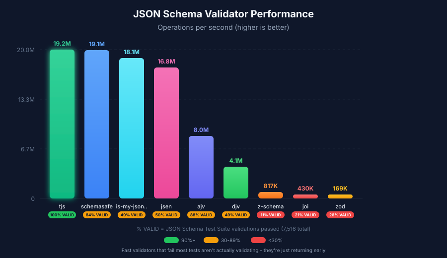

<p align="center">
  <a href="https://sberan.github.io/tjs/">
    
  </a>
</p>

<p align="center">
  <strong>The world's fastest and most accurate json-schema validator, with magical typescript inference.</strong>
</p>

<p align="center">
  <a href="https://www.npmjs.com/package/tjs"></a>
  <a href="https://github.com/sberan/tjs/actions/workflows/test.yml"></a>
  <a href="https://sberan.github.io/tjs/"></a>
</p>



100% spec compliance. 49% faster than ajv. Zero dependencies. Full TypeScript inference.


## At a Glance

| | tjs | [ajv](https://github.com/ajv-validator/ajv) | [zod](https://github.com/colinhacks/zod) | [joi](https://github.com/hapijs/joi) |
|---|:---:|:---:|:---:|:---:|
| **JSON Schema compliance** | 100% | 95% | Basic | None |
| **TypeScript inference** | Built-in | Plugin | Built-in | None |
| **Dependencies** | 0 | 4+ | 0 | 5+ |
| **Performance** | Fastest | Fast | Slow | Slow |

## Installation

```bash
npm install tjs
```

## Quick Start

```typescript
import { schema } from 'tjs';

const User = schema({
  type: 'object',
  properties: {
    name: { type: 'string' },
    email: { type: 'string', format: 'email' },
    age: { type: 'integer', minimum: 0 },
  },
  required: ['name', 'email'],
});

type User = typeof User.type; // Extract the type


// Validate with full type inference
const user = User.assert(data);
//   ^? { name: string; email: string; age?: number }
```

## Why tjs?

 * Bridge the gap between json-schema and TypeScript types with no code duplication.
 * Types are guaranteed to be correct at compile time and run time.
 * Sticking to json-schema means your schema can be published to third parties with no translation layer.

### 100% JSON Schema Compliance

tjs passes the entire [JSON Schema Test Suite](https://github.com/json-schema-org/JSON-Schema-Test-Suite) — the official compliance benchmark:

| Draft | Compliance |
|-------|------------|
| draft-04 | 100% (882/882) |
| draft-06 | 100% (1170/1170) |
| draft-07 | 100% (1534/1534) |
| draft-2019-09 | 100% (1941/1941) |
| draft-2020-12 | 100% (1990/1990) |
| **Total** | **100% (7517/7517)** |

See [COMPLIANCE.md](COMPLIANCE.md) for details.

### Blazing Fast

See [BENCHMARKS.md](BENCHMARKS.md) for detailed performance comparison.
tjs uses JIT compilation to generate optimized validation code — **49% faster than ajv** overall:

```
Performance vs ajv (JSON Schema Test Suite):
--------------------------------------------------------------------------------
Draft          Files   Tests | tjs ns/test  ajv ns/test      Diff
--------------------------------------------------------------------------------
draft-04         43     881 |         40           76      -47%
draft-06         52    1170 |         34           67      -50%
draft-07         63    1534 |         64           75      -14%
draft-2019-09    77    1941 |         55          154      -64%
draft-2020-12    80    1990 |         52          152      -66%
--------------------------------------------------------------------------------
TOTAL            315    7516 |         51          100      -49%
--------------------------------------------------------------------------------
```

Format validation is where tjs really shines — up to **253x faster** for complex formats:

```
idn-email                253x faster than ajv
date-time                9x faster than ajv
ipv6                     5x faster than ajv
```

#### Why is tjs faster?

tjs achieves its performance through several code generation optimizations that ajv doesn't implement:

| Optimization | tjs | ajv |
|--------------|-----|-----|
| **Format validators** | Character-code parsing with lookup tables | Complex regex patterns (800+ chars for ipv6) |
| **typeof caching** | Caches `typeof` result once for multi-type checks | Calls `typeof` repeatedly |
| **oneOf early exit** | Returns immediately when 2nd match found | Evaluates all branches, tracks matches in arrays |
| **Error allocation** | Pre-compiled error objects, zero allocation in hot path | Creates error objects inline during validation |

The format validators show the largest gains. For example, `date-time` validation in tjs uses direct character code comparisons:

```javascript
// tjs: ~140 lines of simple character code checks
if (s.charCodeAt(4) !== 45) return false; // '-'
const year = (s.charCodeAt(0) - 48) * 1000 + ...
```

vs ajv-formats which uses regex with potential backtracking:

```javascript
// ajv-formats: regex pattern
/^\d\d\d\d-[0-1]\d-[0-3]\dt(?:[0-2]\d:[0-5]\d:[0-5]\d|23:59:60)(?:\.\d+)?(?:z|[+-]\d\d(?::?\d\d)?)$/i
```

### Magical Type Inference

tjs infers TypeScript types directly from your schema — no code generation, no separate type definitions:

```typescript
import { schema } from 'tjs';

const Product = schema({
  type: 'object',
  properties: {
    id: { type: 'string', format: 'uuid' },
    name: { type: 'string' },
    price: { type: 'number', minimum: 0 },
    tags: { type: 'array', items: { type: 'string' } },
    status: { enum: ['active', 'discontinued'] },
  },
  required: ['id', 'name', 'price'],
});

// Extract the inferred type
type Product = typeof Product.type;
// { id: string; name: string; price: number; tags?: string[]; status?: 'active' | 'discontinued' }
```

Types are inferred for:
- All primitive types (`string`, `number`, `integer`, `boolean`, `null`)
- Arrays with `items` and `prefixItems` (tuples)
- Objects with `properties`, `additionalProperties`, `patternProperties`
- Union types via `anyOf`, `oneOf`
- Intersection types via `allOf`
- Const and enum literals
- Conditional schemas with `if`/`then`/`else`
- Recursive schemas with `$ref` and `$defs`

### Zero Runtime Dependencies

tjs has **zero runtime dependencies**. The entire library is ~25KB minified.

Compare to ajv which requires:
- `fast-deep-equal`
- `json-schema-traverse`
- `require-from-string`
- `uri-js` (which itself has dependencies)

## API

### `schema(definition, options?)`

Create a validator from a JSON Schema:

```typescript
const User = schema({
  type: 'object',
  properties: {
    name: { type: 'string' },
    age: { type: 'integer' },
  },
  required: ['name'],
});
```

### `validator.validate(data)`

Validate and return result with value or error:

```typescript
const result = User.validate(input);

if (result.error === undefined) {
  console.log(result.value);  // Typed & coerced data
} else {
  console.log(result.error);  // Validation errors with paths
}
```

### `validator.assert(data)`

Assert validity, throwing on failure. Returns coerced value:

```typescript
try {
  const user = User.assert(input);  // Returns typed, coerced data
  console.log(user.name);
} catch (e) {
  console.error('Invalid:', e.message);
}
```

### `struct(properties, options?)`

Ergonomic helper for object schemas:

```typescript
import { struct } from 'tjs';

const User = struct({
  id: 'string',
  name: 'string',
  email: { type: 'string', format: 'email' },
  age: { type: 'integer', minimum: 0, optional: true },
  role: { enum: ['admin', 'user'], optional: true },
});

type User = typeof User.type

// Automatically infers:
// { id: string; name: string; email: string; age?: number; role?: 'admin' | 'user' }
```

### `schemaAsync(definition, options?)`

Create a validator that automatically fetches remote `$ref` schemas:

```typescript
const validator = await schemaAsync({
  $ref: 'https://json-schema.org/draft/2020-12/schema',
});
```

### Schema Composition

Include validators directly in other schemas for easy composition:

```typescript
// Define reusable schemas
const Address = schema({
  type: 'object',
  properties: {
    street: { type: 'string' },
    city: { type: 'string' },
    zip: { type: 'string' },
  },
  required: ['street', 'city'],
});

// Include in another schema
const Person = schema({
  type: 'object',
  properties: {
    name: { type: 'string' },
    address: Address,  // Use validator directly
  },
  required: ['name', 'address'],
});

type Person = typeof Person.type;
// { name: string; address: { street: string; city: string; zip?: string } }
```

Works in arrays, anyOf, allOf, and any other schema position:

```typescript
const Team = schema({
  type: 'object',
  properties: {
    name: { type: 'string' },
    members: { type: 'array', items: Person },  // Array of Person
    headquarters: Address,
  },
  required: ['name', 'members', 'headquarters'],
});
```

Access the underlying schema via the `.schema` property:

```typescript
console.log(Address.schema);
// { type: 'object', properties: { ... }, required: ['street', 'city'] }
```

## Type Coercion

Automatically coerce values to match schema types:

```typescript
const Config = schema({
  type: 'object',
  properties: {
    port: { type: 'integer' },
    debug: { type: 'boolean' },
    timeout: { type: 'number' },
  },
}, { coerce: true });

// String values are coerced to match types
const result = Config.validate({ port: '3000', debug: 'true', timeout: '30.5' });
result.value; // { port: 3000, debug: true, timeout: 30.5 }
```

Supported coercions:
- Strings to numbers/integers (`"42"` → `42`)
- Strings/numbers to booleans (`"true"`, `1` → `true`)
- Strings to null (`""`, `"null"` → `null`)
- Single values to arrays (`"item"` → `["item"]`)

## Options

```typescript
interface ValidatorOptions {
  // Enable format validation (default: false for 2019-09+, true for draft-07 and earlier)
  formatAssertion?: boolean;

  // Enable content validation for contentMediaType/contentEncoding (default: false)
  contentAssertion?: boolean;

  // Pre-loaded remote schemas for $ref resolution
  remotes?: Record<string, JsonSchema>;

  // Use legacy $ref behavior where $ref ignores siblings (default: true)
  legacyRef?: boolean;

  // Enable type coercion (default: false)
  coerce?: boolean | {
    string?: boolean;
    number?: boolean;
    integer?: boolean;
    boolean?: boolean;
    null?: boolean;
    array?: boolean;
  };
}
```

## License

MIT
